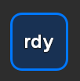
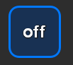
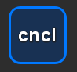
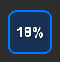

# StreamDeck Plugin for OctoPrint

This plugin shows your 3D-Printer completion state in percent on your StreamDeck ([OctoPrint](https://github.com/OctoPrint/OctoPrint) required)

## Installation
1. Download the latest release. Double click on the file `com.cpeuschel.octodeck.streamDeckPlugin` to install.

## Configuration
1. Choose your favourite color and font (see example)
   
   
2. Add your OctoPrint Url e.g `http://192.168.178.13`
3. Add your API-Key [click](https://docs.octoprint.org/en/master/api/general.html#authorization)
4. Hit Save.
   
    

## Use
Click the icon on your StreamDeck to update the completion. Automatic update every 5 minutes

## Available States
- `rdy` => the printer is connected and is ready to print

    
- `off` => the printer is not connected with OctoPrint

    
- `cncl` => print is canceling
  
    
- `%` => Completion in percent  

    
