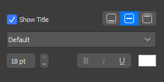
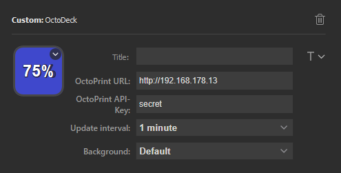

# Stream Deck Plugin for OctoPrint

This plugin shows your printer completion state in percent on your StreamDeck with OctoPrint

## Installation
1. Download the latest release. Double click on the file `com.cpeuschel.octodeck.streamDeckPlugin` to install.
2. You should see in the StreamDeck Application under `Custom` the octodeck plugin.  

## Configuration
1. Change the font to 18 pt use your favourite color (see e example)
   
   
2. Add your OctoPrint Url e.g `http://192.168.178.13`
3. Add your API-Key (https://docs.octoprint.org/en/master/api/general.html#authorization)
4. Hit Save.
   

## Available States
- `rdy` => the printer is connected and is ready or finish
- `off` => the printer is not connected with OctoPrint
